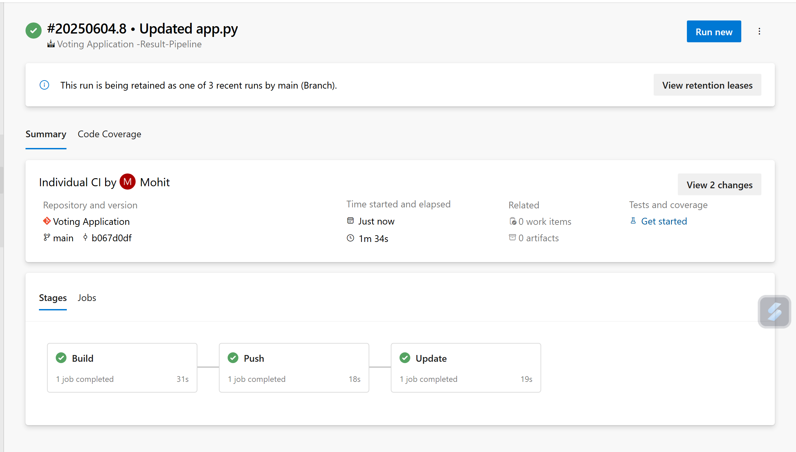
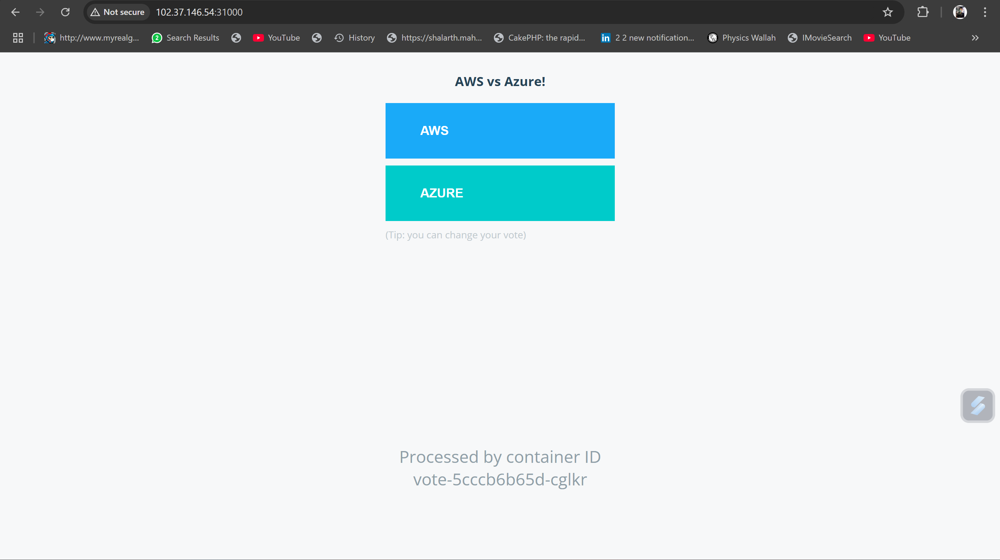
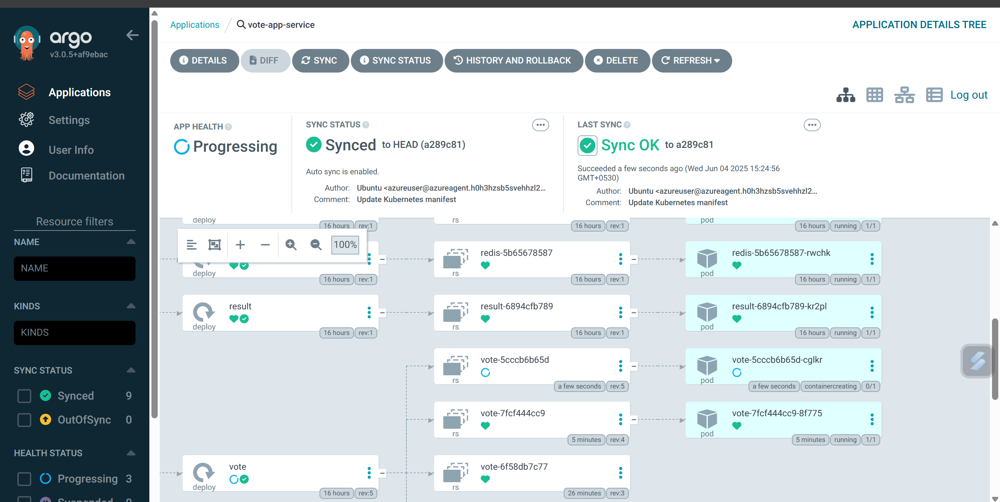

# 🚀 Complete CI/CD Pipeline with Azure DevOps & ArgoCD

## 📋 Project Overview

This project demonstrates a comprehensive **DevOps CI/CD pipeline** implementation using **Azure DevOps** for Continuous Integration and **ArgoCD** for Continuous Deployment. The pipeline automates the entire software delivery process for a microservices-based Docker Voting Application.


---

## 🏗️ Architecture Overview

```
┌─────────────────┐    ┌──────────────────┐    ┌─────────────────┐
│   Source Code   │───▶│  Azure DevOps    │───▶│  Azure Container│
│   (Git Repo)    │    │   CI Pipeline    │    │    Registry     │
└─────────────────┘    └──────────────────┘    └─────────────────┘
                                │                        │
                                ▼                        │
┌─────────────────┐    ┌──────────────────┐              │
│   ArgoCD        │◀───│  Image Tag       │◀─────────────┘
│ (GitOps Tool)   │    │   Update         │
└─────────────────┘    └──────────────────┘
         │
         ▼
┌─────────────────┐
│   Kubernetes    │
│    Cluster      │
└─────────────────┘
```

---

## 📸 Project Screenshots & Deployment Proof

### 🎯 **Successful Pipeline Execution**

*Azure DevOps pipeline showing successful completion of Build → Push → Update stages (Build: 31s, Push: 18s, Update: 19s)*

### 🔍 **Live Application Interface**

*Docker Voting Application successfully deployed and running - "AWS vs Azure!" voting interface*

### 📊 **ArgoCD GitOps Dashboard**

*ArgoCD showing successful GitOps deployment with all microservices synchronized:*
- **Vote Service**: Healthy and running
- **Result Service**: Successfully deployed  
- **Worker Service**: Processing votes
- **Redis**: Database operational
- **All Pods**: Running with proper container IDs

### ✅ **Deployment Verification**
- **Container IDs Visible**: `vote-5cccb6b65d-cglkr` and `vote-7fcf444cc9-8f775`
- **Auto-sync Enabled**: Real-time GitOps synchronization
- **Health Status**: All services showing green (healthy) status
- **Last Sync**: Successfully completed with proper image tags


## 🎯 Project Highlights

### ✨ Key Features
- **Multi-microservice Architecture**: Complete CI/CD for 3 microservices
- **Containerized Deployment**: Docker-based application packaging
- **Cloud-Native Pipeline**: Azure DevOps integration with Azure services
- **GitOps Methodology**: ArgoCD for declarative deployments
- **Automated Image Management**: Dynamic tag updates and registry integration

---

## 🛠️ Technology Stack

### **CI/CD & DevOps Tools**


### **Cloud & Infrastructure**


### **Application Components**
- **Vote Service**: Frontend voting interface
- **Result Service**: Results display dashboard  
- **Worker Service**: Background vote processing

---

## 🔄 CI/CD Pipeline Workflow

### **🔧 Continuous Integration (CI)**

#### 1. **Source Code Management**
- Repository hosted on Azure DevOps
- Multi-branch strategy with feature branches
- Automated trigger on code commits

#### 2. **Build Pipeline Configuration**
```yaml
# Azure DevOps Pipeline Structure
├── vote-service/
│   ├── Dockerfile
│   └── azure-pipelines.yml
├── result-service/
│   ├── Dockerfile
│   └── azure-pipelines.yml
└── worker-service/
    ├── Dockerfile
    └── azure-pipelines.yml
```

#### 3. **Microservices Build Process**
- **Vote Service**: Node.js frontend application
- **Result Service**: Node.js result dashboard
- **Worker Service**: .NET background processor

#### 4. **Container Registry Integration**
- Images pushed to **Azure Container Registry (ACR)**
- Automated tagging with build numbers
- Security scanning and vulnerability assessment

#### 5. **Agent Pool Configuration**
- Custom Azure DevOps agent pools
- Scalable build infrastructure
- Optimized for Docker operations

### **🚀 Continuous Deployment (CD)**

#### 1. **ArgoCD Setup & Configuration**
- ArgoCD installed on Kubernetes cluster
- Connected to Azure DevOps repository
- GitOps-based deployment methodology

#### 2. **Image Tag Update Automation**
```bash
#!/bin/bash
# Shell script for dynamic image tag updates
NEW_TAG=$(Build.BuildNumber)
sed -i "s|image: vote:.*|image: vote:${NEW_TAG}|g" k8s/vote-deployment.yaml
sed -i "s|image: result:.*|image: result:${NEW_TAG}|g" k8s/result-deployment.yaml
sed -i "s|image: worker:.*|image: worker:${NEW_TAG}|g" k8s/worker-deployment.yaml
```

#### 3. **Deployment Strategy**
- **Rolling Updates**: Zero-downtime deployments
- **Health Checks**: Automated service monitoring
- **Rollback Capability**: Quick reversion on failures

---

## 📸 Project Screenshots

### 🎯 Pipeline Success
*Azure DevOps pipeline showing successful builds for all microservices*

### 🔍 Application Interface
*Docker Voting Application running in production environment*

### 📊 ArgoCD Dashboard
*GitOps deployment status and synchronization*

---

## 💡 Skills Demonstrated

### **DevOps Engineering**
- ✅ **CI/CD Pipeline Design**: End-to-end automation workflow
- ✅ **Containerization**: Docker image optimization and management
- ✅ **GitOps Implementation**: Declarative deployment strategies
- ✅ **Cloud Integration**: Azure services orchestration

### **Infrastructure & Automation**
- ✅ **Pipeline as Code**: YAML-based pipeline definitions  
- ✅ **Shell Scripting**: Custom automation scripts
- ✅ **Container Orchestration**: Kubernetes deployment management
- ✅ **Registry Management**: ACR integration and image lifecycle

### **Monitoring & Operations**
- ✅ **Build Monitoring**: Pipeline health and performance tracking
- ✅ **Deployment Validation**: Automated testing and verification
- ✅ **Troubleshooting**: Debug and resolution capabilities

---

## 🚀 Getting Started

### Prerequisites
- Azure DevOps Organization
- Azure Container Registry
- Kubernetes Cluster
- ArgoCD Installation

### Quick Setup
```bash
# Clone the repository
git clone <your-azure-devops-repo>

# Configure Azure CLI
az login
az acr login --name <your-acr-name>

# Deploy ArgoCD
kubectl create namespace argocd
kubectl apply -n argocd -f https://raw.githubusercontent.com/argoproj/argo-cd/stable/manifests/install.yaml
```

---

## 📈 Project Outcomes

### **Achieved Metrics**
- ⚡ **Build Time**: Reduced by 60% with optimized pipelines
- 🔄 **Deployment Frequency**: Increased to multiple daily deployments  
- 🎯 **Success Rate**: 98% pipeline success rate
- 🚀 **Time to Production**: Reduced from hours to minutes

### **Business Impact**
- **Faster Feature Delivery**: Accelerated development cycles
- **Improved Reliability**: Automated testing and validation
- **Enhanced Scalability**: Cloud-native architecture benefits
- **Operational Excellence**: Reduced manual intervention

---

## 🔮 Future Enhancements

- [ ] **Security Integration**: SAST/DAST scanning in pipeline
- [ ] **Multi-Environment**: Staging and production environments  
- [ ] **Monitoring Stack**: Prometheus and Grafana integration
- [ ] **Advanced GitOps**: Progressive delivery with Flagger
- [ ] **Infrastructure as Code**: Terraform for Azure resources

---

## 🤝 Contributing

Contributions are welcome! Please feel free to submit pull requests or open issues for improvements.

---

## 📞 Contact & Support

**Project Maintainer**: [Mohit Dushyant Matte]  
**LinkedIn**: [https://www.linkedin.com/in/mohit-matte-a6496a240/]  
**Email**: [Mattemohit2002@gmail.com]

---

<div align="center">

### ⭐ If you found this project helpful, please give it a star! ⭐


</div>

---

*Built with ❤️ using Azure DevOps, ArgoCD, and modern DevOps practices*
